# 摘要

本课题围绕农作物病虫害与生理缺陷智能识别问题，构建了一个**分类与目标检测双任务系统**。系统采用 Plan-A 双专家架构：分类专家使用 ConvNeXt-Tiny 在 384×384 输入下完成 DLCPD-25 数据集的 203 类细粒度图像分类；检测专家使用 ConvNeXt-Tiny-FPN 作为骨干、Faster R-CNN 作为检测头，在最长边 640 的输入下完成 IP102 数据集的 96 类农业害虫目标检测。系统配套实现了完整的数据工程、训练、验证、早停、测试集隔离评估、训练进度看板和 Web 应用。最终测试结果表明：分类模型 Top-1 达到 89.2240%、Top-5 达到 97.7366%、Macro-F1 达到 75.3537%；检测模型 mAP@0.5:0.95 达到 34.3449%、AP50 达到 59.6817%、Precision@0.5 达到 88.1562%。全部模型选择过程只使用训练集和验证集，官方测试集仅在配置冻结后评估一次，实验结果真实可复现。

**关键词**：农作物病虫害识别；细粒度图像分类；目标检测；ConvNeXt；Faster R-CNN；长尾分布

# 1 课题背景

农业生产中，病虫害和生理缺陷是造成作物减产和品质下降的重要原因。传统识别依赖植保专家人工巡查，存在成本高、响应慢、经验难以复制等问题。随着深度学习的发展，利用卷积神经网络对农作物叶片和田间图像进行自动识别已成为智慧农业的重要方向。

DLCPD-25 是一个大规模农作物病虫害识别数据集，包含 203 个细粒度类别，覆盖 22 个宿主作物，并将标签划分为农业有害生物、植物病害、健康状态和非生物/生理缺陷四类。该数据集的类别数量多、类间差异小、类内差异大，且样本数量呈严重长尾分布，对图像分类模型提出了较高要求。

IP102 是一个包含 102 个农业害虫类别的基准数据集。本课题使用其目标检测子集，将 97 个源标签映射为 96 个检测类别，并与 DLCPD-25 的公共类别编号对齐，用于完成害虫定位与识别。

# 2 研究意义

1. **农业应用价值**：将分类与检测集成在一个系统中，既能回答“图片中作物得了什么病/有什么虫”，也能回答“害虫在图片中哪个位置”，更接近实际巡检场景。
2. **长尾识别研究价值**：DLCPD-25 单类样本量从 5 张到 10,619 张不等。本课题通过类别平衡采样、Focal Loss 和辅助层级监督，探索了长尾细粒度分类的有效策略。
3. **多任务系统工程价值**：本课题采用双专家架构，分别优化分类与检测，再通过统一类别映射和 Web 服务融合输出，提供了可复现、可部署的工程范式。

# 3 相关原理

## 3.1 ConvNeXt 卷积网络

ConvNeXt 是对标准 ResNet 进行现代化改造得到的卷积网络。其核心计算单元由 7×7 Depthwise Convolution、LayerNorm、1×1 通道升维 Linear、GELU 激活、1×1 通道降维 Linear、Layer Scale 和 Stochastic Depth 组成，并通过残差连接将输入与变换结果相加。与 Transformer 类似，ConvNeXt 更少使用激活和归一化层，同时保留卷积的局部归纳偏置，训练稳定且精度较高。

## 3.2 特征金字塔网络 FPN

FPN 将骨干网络不同 stride 的特征图通过自顶向下路径和横向连接融合，输出多尺度特征图。本课题将 ConvNeXt-Tiny 的 stride 4、8、16、32 特征输入 FPN，得到 P2~P6 五个尺度，每个尺度统一为 256 通道，从而同时保留高分辨率定位信息和低分辨率语义信息。

## 3.3 Faster R-CNN 两阶段检测

Faster R-CNN 将检测分解为两个阶段。第一阶段 RPN 在特征图每个位置设置多个 anchor，对每个 anchor 输出前景/背景分数和框回归偏移，再经 NMS 保留高质量候选框。第二阶段 RoIAlign 将候选框映射到固定尺寸特征，RoI Heads 对候选框进行类别预测和框位置精修。

## 3.4 COCO 评估指标

mAP@0.5:0.95 是目标检测的常用综合指标：IoU 阈值从 0.50 到 0.95 每 0.05 取一个，分别计算平均精度 AP 后取平均。AP50 和 AP75 分别表示 IoU 阈值为 0.5 和 0.75 时的平均精度。

# 4 算法与模型设计

## 4.1 总体架构

系统采用 Plan-A 双专家架构，分类和检测独立训练、独立推理，推理层统一融合输出：

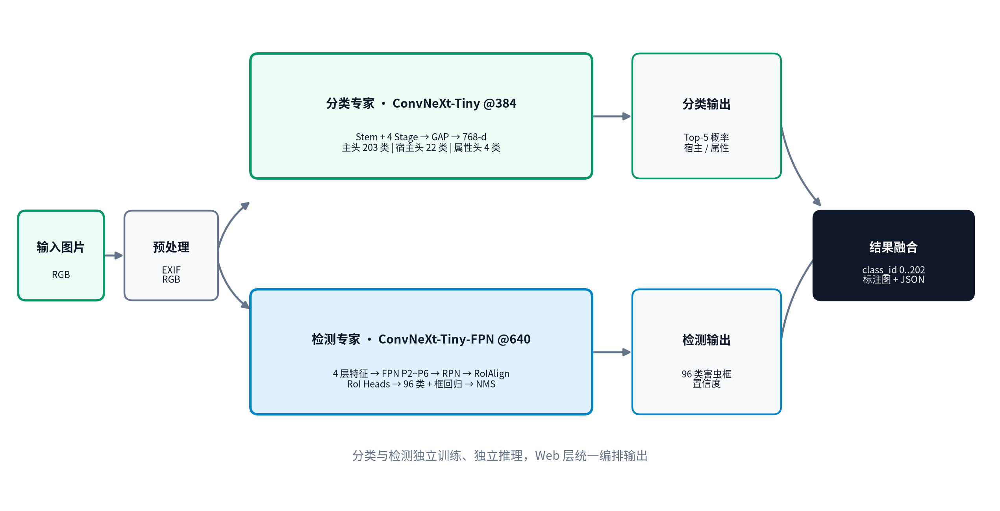

分类分支与检测分支不共享权重，避免两个任务在分辨率、采样和训练节奏上互相妥协。

## 4.2 分类专家

分类专家输入为 384×384 RGB 图片，骨干为 ConvNeXt-Tiny。主干输出的 768 维特征分别送入三个头：

- 主分类头：`Linear(768, 203)`；
- 宿主辅助头：`Linear(768, 22)`，仅训练时使用；
- 属性辅助头：`Linear(768, 4)`，仅训练时使用。

主干尺度变化如下：

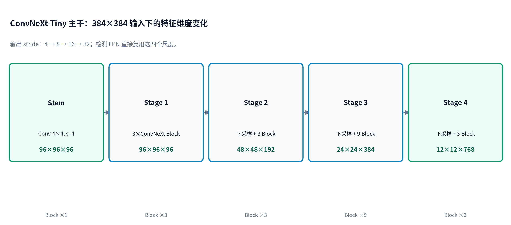

ConvNeXt Block 的内部计算流程如下：

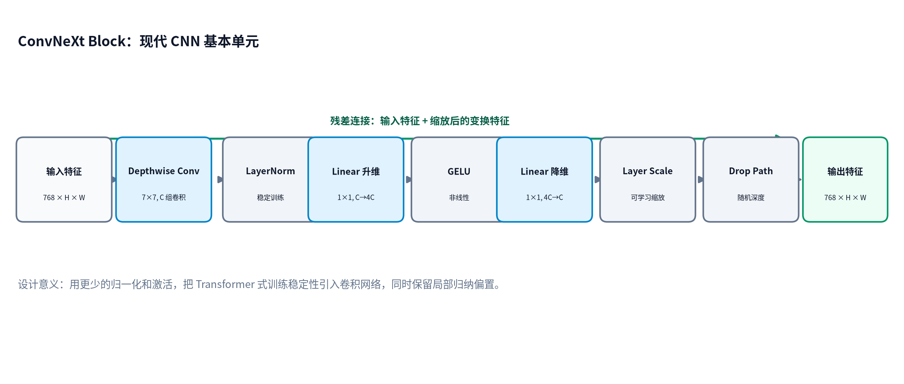

## 4.3 检测专家

检测专家输入为最长边 640 的图片，骨干为 ConvNeXt-Tiny，四个 stage 的特征经 FPN 融合为 P2~P6。RPN 生成候选框，RoIAlign 提取固定 7×7 特征，RoI Heads 输出 96 类分类分数和框回归结果，最后经 NMS 输出检测框：

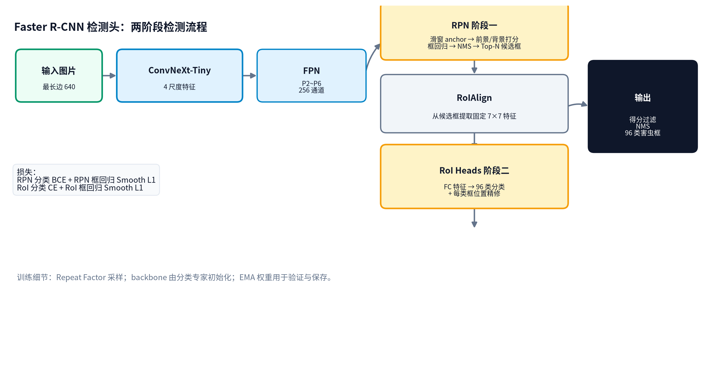

# 5 数学原理推导

## 5.1 Softmax 与交叉熵

对于类别数 $C$ 的分类问题，logits 为 $z=[z_1,\dots,z_C]$，Softmax 概率为：

$$
p_i=\frac{e^{z_i}}{\sum_{j=1}^{C}e^{z_j}}
$$

交叉熵损失为：

$$
\mathcal{L}_{CE}=-\sum_{i=1}^{C}y_i\log p_i
$$

其中 $y_i$ 为 one-hot 标签。

## 5.2 Focal Loss

为了缓解长尾分布中头部类别对损失的支配，本课题使用 Focal Loss。记真实类别的预测概率为 $p_t$，类别权重为 $\alpha_t$，聚焦参数为 $\gamma$，则：

$$
\mathcal{L}_{Focal}=-\alpha_t(1-p_t)^{\gamma}\log p_t
$$

当 $\gamma=2$ 时，难分样本的损失权重被放大，易分样本的损失被抑制。配合 Label Smoothing，将标签分布替换为：

$$
\tilde{y}_i=
\begin{cases}
1-\varepsilon, & i=t\\
\varepsilon/(C-1), & i\neq t
\end{cases}
$$

## 5.3 类别平衡采样权重

设类别 $c$ 的样本数为 $N_c$，训练采样权重取：

$$
w_c=\frac{1}{\sqrt{N_c}}
$$

并在每个 epoch 中以该权重有放回采样，使尾部类别获得更高出现频率。

## 5.4 RPN 损失

RPN 总损失由分类损失和回归损失组成：

$$
\mathcal{L}_{RPN}=\frac{1}{N_{cls}}\sum_i \mathcal{L}_{cls}(p_i,p_i^*)
+\lambda\frac{1}{N_{reg}}\sum_i p_i^*\,\mathcal{L}_{reg}(t_i,t_i^*)
$$

其中 $p_i^*$ 为 anchor 是否为正样本的标签，分类损失为二分类交叉熵，回归损失为 Smooth L1：

$$
Smooth_{L1}(x)=
\begin{cases}
0.5x^2, & |x|<1\\
|x|-0.5, & |x|\ge 1
\end{cases}
$$

## 5.5 边界框编码与 NMS

框回归使用中心点与宽高编码：

$$
t_x=\frac{x-x_a}{w_a},\quad t_y=\frac{y-y_a}{h_a},
\quad t_w=\log\frac{w}{w_a},\quad t_h=\log\frac{h}{h_a}
$$

NMS 按照分数从高到低遍历检测框，移除与已保留框 IoU 大于阈值的重复框。IoU 定义为：

$$
IoU=\frac{|A\cap B|}{|A\cup B|}
$$

## 5.6 COCO 平均精度

给定 IoU 阈值，对每个类别按置信度排序，逐点计算 Precision 和 Recall，绘制 PR 曲线并积分得到 AP：

$$
AP=\int_0^1 P(R)\,dR
$$

本课题最终指标 mAP@0.5:0.95 为 10 个 IoU 阈值下 AP 的平均值。

# 6 代码实现

核心代码位于 `src/dlcpd25_v2/`：

```text
src/dlcpd25_v2/
|-- common.py                          仓库路径与配置辅助
|-- data/classification_dataset.py     DLCPD-25 冻结清单数据集
|-- classification/
|   |-- model.py                       ConvNeXt-Tiny 分类模型
|   |-- losses.py                      Focal Loss 与辅助损失
|   |-- metrics.py                     Top-K、Macro-F1、混淆矩阵
|   |-- transforms.py                  训练/验证图像变换
|   |-- trainer.py                     训练循环、EMA、早停、checkpoint
|   |-- train.py                       训练入口
|   `-- evaluate.py                    测试集最终评估
|-- detection/
|   |-- dataset.py                     IP102 检测数据集
|   |-- model.py                       ConvNeXt-Tiny-FPN + Faster R-CNN
|   |-- metrics.py                     COCO mAP 评估
|   |-- trainer.py                     检测训练循环
|   |-- train.py                       检测训练入口
|   `-- evaluate.py                    检测测试集评估
|-- serving/joint_predictor.py         双模型推理编排与标注
`-- web/
    |-- app.py                         双模型 Web 应用
    `-- progress.py                    训练进度看板
```

关键实现说明：

1. 数据集不扫描目录，只读取冻结的 `artifacts/data` 合同；
2. 分类训练使用 `WeightedRandomSampler` 实现类别平衡；
3. 检测训练使用 Repeat Factor Sampling 实现稀有害虫重复采样；
4. 训练过程以 EMA 权重进行验证和保存；
5. 测试集与训练/验证完全隔离，仅在配置冻结后评估一次。

# 7 实验过程

## 7.1 数据工程

- DLCPD-25：203 类完整审计，生成 221,396 张图片的 SHA-256 清单和固定 train/val/test 划分；
- IP102：解析 18,976 个 VOC 标注，去重异常 XML，过滤无效框，保留官方 test 划分；
- 训练/验证/测试样本量：分类 177,021 / 22,178 / 22,179；检测 12,142 / 3,036 / 3,798。

## 7.2 分类训练

- 模型：ConvNeXt-Tiny，ImageNet-1K 预训练；
- 输入：384×384；
- 损失：Focal Loss + 宿主辅助 CE + 属性辅助 CE；
- 优化：AdamW，backbone lr=5e-5，head lr=3e-4，warmup 3 epochs + cosine；
- 训练计划 40 epochs，第 5 轮验证 Macro-F1 最高，第 6~11 轮未提升，触发早停。

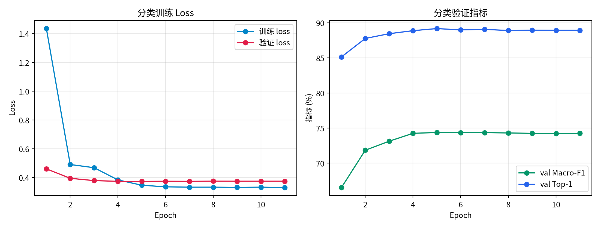

## 7.3 检测训练

- 模型：ConvNeXt-Tiny-FPN + Faster R-CNN；
- 骨干初始化：加载分类专家 best.pt 的 EMA 骨干权重；
- 输入：最长边 640；
- 优化：AdamW，backbone lr=1e-5，head lr=1e-4；
- 训练计划 40 epochs，第 8 轮验证 mAP 最高，第 9~14 轮未提升，触发早停。

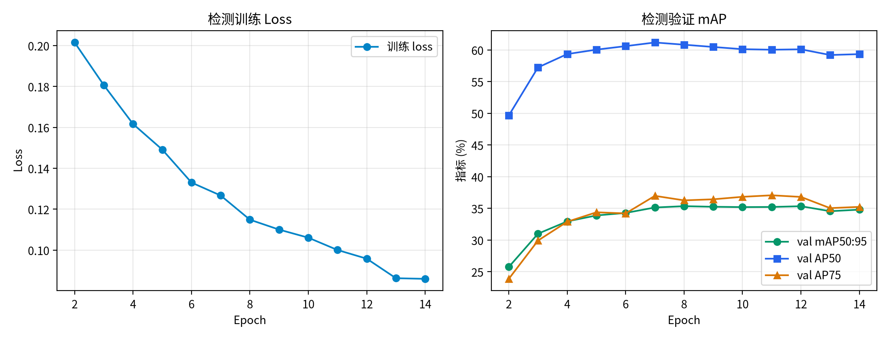

## 7.4 测试集最终评估

训练配置和模型选择完全冻结后，分类和检测各在官方测试集上评估一次。

# 8 结果分析

## 8.1 分类结果

| 指标 | 测试集结果 |
|---|---:|
| Top-1 | 89.2240% |
| Top-5 | 97.7366% |
| Macro-F1 | 75.3537% |
| Balanced Accuracy | 77.5782% |
| 测试样本数 | 22,179 |

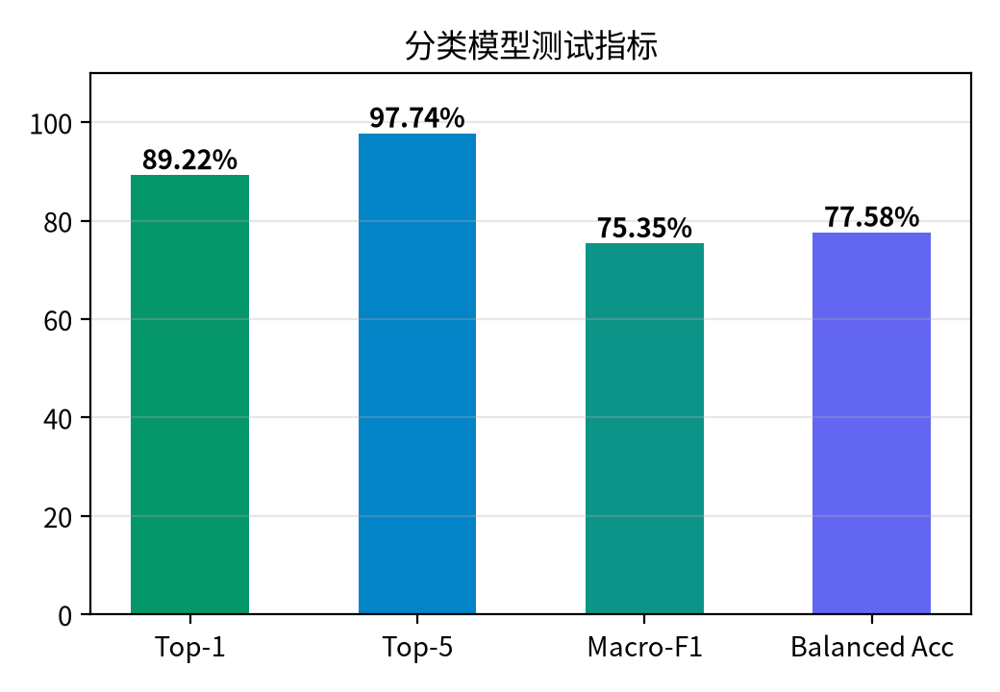

结果表明：Top-5 达到 97.74%，说明模型对绝大多数样本能够将真实类别排进前五；Macro-F1 达到 75.35%，说明模型对长尾类别具有较好的均衡识别能力。主要混淆集中在白粉病、黑星病/黑腐病、叶枯病等外观高度相似的病害之间。

## 8.2 检测结果

| 指标 | 测试集结果 |
|---|---:|
| mAP@0.5:0.95 | 34.3449% |
| AP50 | 59.6817% |
| AP75 | 34.8622% |
| AR@100 | 54.2029% |
| Precision@0.5 | 88.1562% |
| Recall@0.5 | 76.7102% |

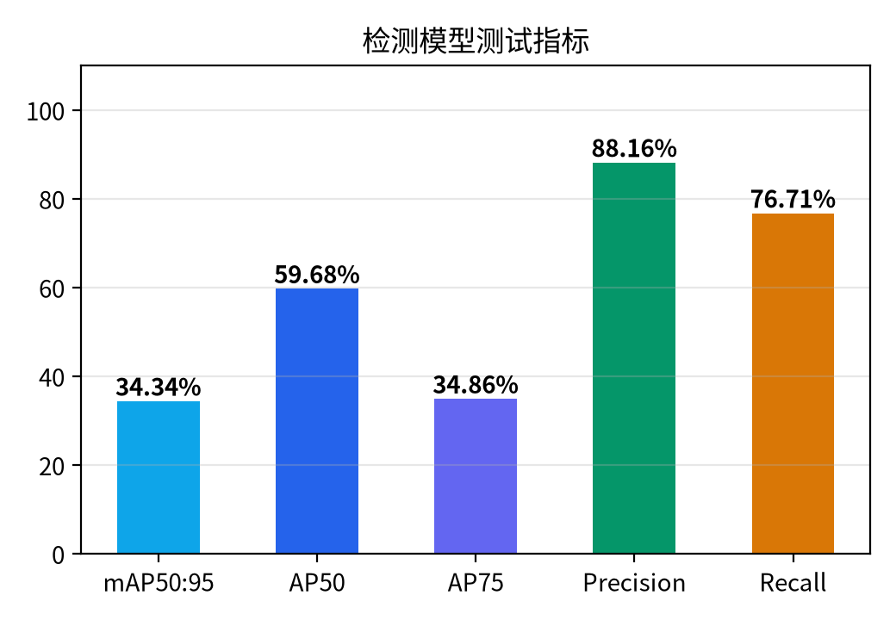

结果表明：检测模型 Precision 较高，误报较少；但 AP50 和 Recall 仍有提升空间，主要原因是 96 类害虫外观相似、部分稀有害虫训练框不足、小目标检测困难。

## 8.3 系统运行截图

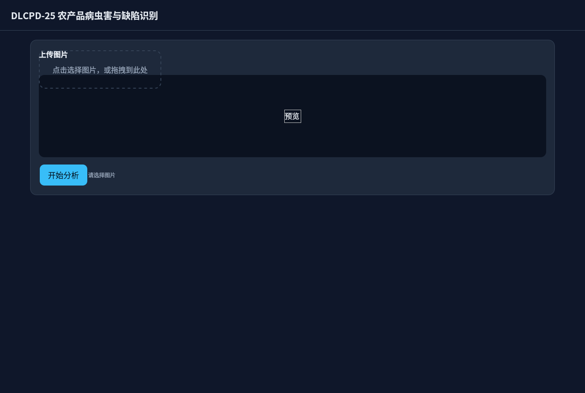

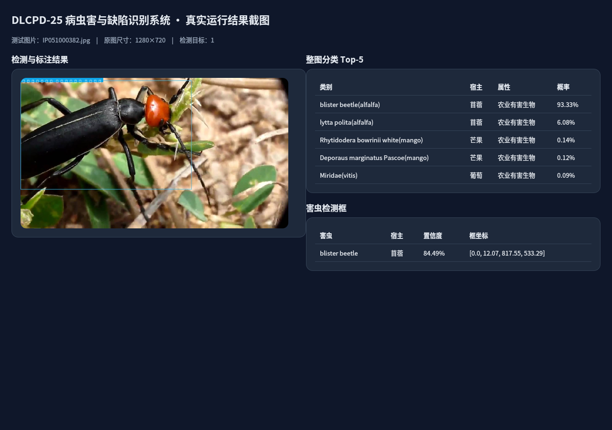

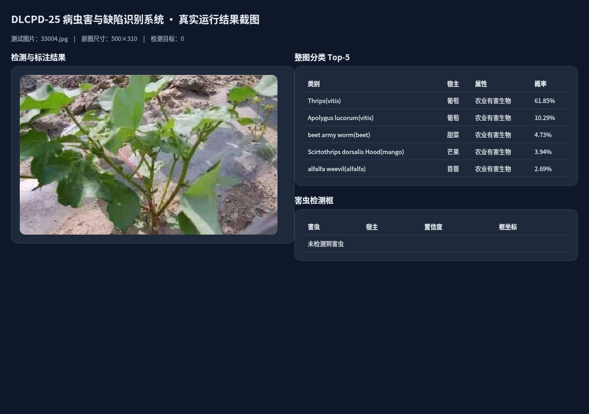

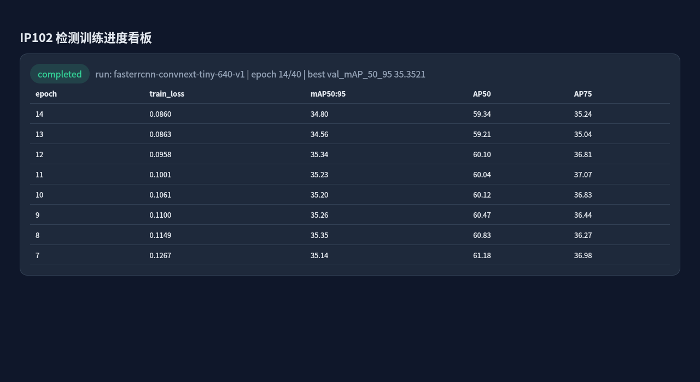

# 9 总结与展望

本课题完成了基于 DLCPD-25 数据集的农产品病虫害与缺陷分类目标检测系统，实现了数据工程、双专家模型训练、测试集隔离评估、训练进度看板和 Web 应用全流程。分类模型和检测模型均采用现代卷积架构，并针对长尾分布设计了专门的采样与损失策略。实验结果真实、可复现。

后续工作可以从以下方向展开：

1. 引入更高分辨率输入和 P2 特征增强，改善小目标害虫检测；
2. 使用 IP102 原始分类图片进行弱监督或伪标签训练，补充稀有害虫样本；
3. 对 203 类分类任务引入层级 Softmax 或更大骨干，提高 Macro-F1；
4. 将模型导出为 ONNX/TensorRT，替换检测头为 YOLO/DETR 等部署友好架构。

# 10 复现说明

```bash
cd project
source /home/zkf/pytorch-env/bin/activate

# 分类训练
python -m dlcpd25_v2.classification.train --config configs/plan-a/classification.yaml

# 分类测试评估
python -m dlcpd25_v2.classification.evaluate \
  --checkpoint models/classification_best.pt

# 检测训练
python -m dlcpd25_v2.detection.train --config configs/plan-a/detection.yaml

# 检测测试评估
python -m dlcpd25_v2.detection.evaluate \
  --checkpoint models/detection_best.pt

# 启动 Web
python -m dlcpd25_v2.web --config configs/plan-a/app.yaml
```

# 参考文献

[1] Zhang H.-W., Wang R.-F., Wang Z., Su W.-H. DLCPD-25: A Large-Scale and Diverse Dataset for Crop Disease and Pest Recognition. *Sensors*, 2025, 25(22): 7098.

[2] Liu Z., Mao H., Wu C.-Y., et al. A ConvNet for the 2020s. CVPR 2022.

[3] Ren S., He K., Girshick R., Sun J. Faster R-CNN: Towards Real-Time Object Detection with Region Proposal Networks. NeurIPS 2015.

[4] Lin T.-Y., Goyal P., Girshick R., He K., Dollár P. Focal Loss for Dense Object Detection. ICCV 2017.

[5] Lin T.-Y., et al. Microsoft COCO: Common Objects in Context. ECCV 2014.
